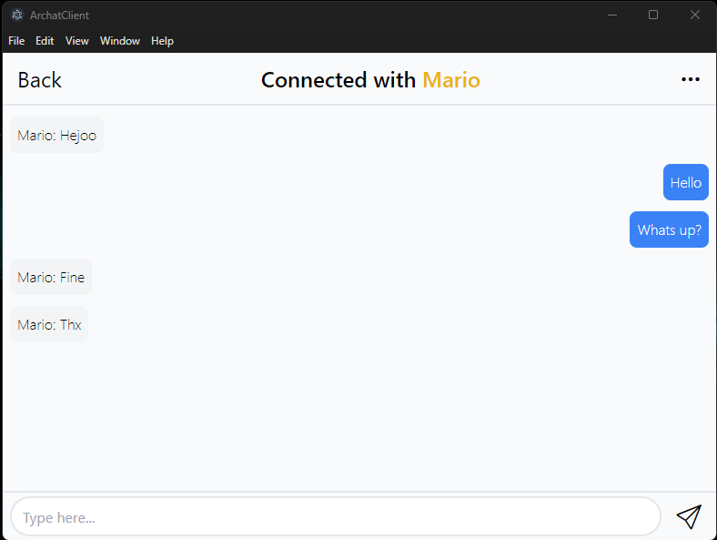
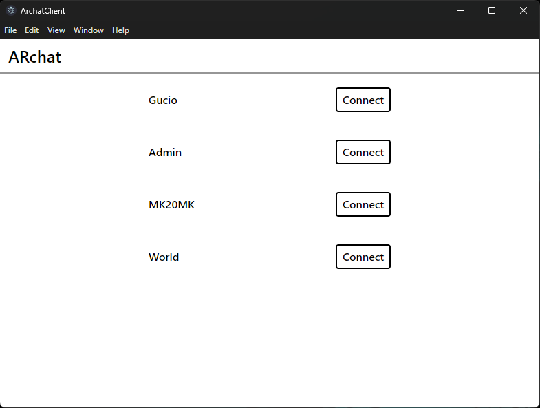
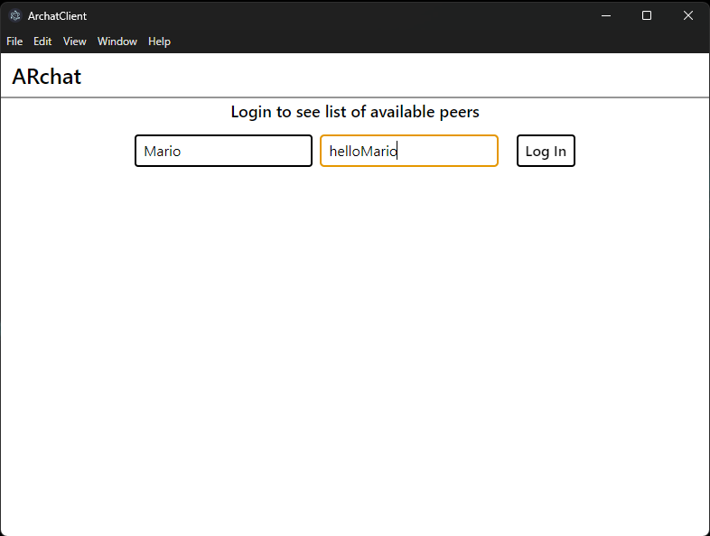

<h1 align="center">⌨️ARchat⌨️</h1>

###

<p align="start">Implementation of a web client for the ARchat server, which provides information exchange about the peers' connection.</p>

> [!IMPORTANT] 
> Project dependent on project [ARchat Server](https://github.com/originalmk/archat-server)


###

<h2 align="center">💻Tech Stack💻</h2>

###

<div align="center">
  
  
  
  
  
  
  
</div>

## Prerequisites

This project was generated with [Angular CLI](https://github.com/angular/angular-cli) version 17.1.2.

Before running the project, ensure you have the following installed:

- Node.js (v18 or later)
- npm (v10 or later)
- Angular CLI (globally installed): `npm install -g @angular/cli`
- Electron: `npm install -g electron`

## Installation

1. **Clone the repository:**
   ```sh
   git clone https://github.com/DamianLaczynski/archat-client.git
   cd archat-client
   ```
2. **Install dependencies:**
    ```sh
    npm install
    ```
    
### Running the Application
1. **Build and Start the Application:**
    ```sh
    npm start
    ```
This command will:
Build the Angular project with the base href set to ./.
Launch the Electron application.

> [!TIP]
> App was automaticaly connected with ARchat server on `81.210.88.10`. For using with own instance of server change WS_ENDPOINT and SIGNALING_SERVER_ADDRESS in signaling.service.ts file.
> 
> Implementation of the server you can find at [ARchat Server](https://github.com/originalmk/archat-server)

### Other Useful Commands

**Build the Angular project:**

```sh
npm run build
```

**Run tests:**

```sh
npm test
```

### Development
During development, you might want to run the Angular application and Electron separately:

**Start Angular development server:**

```sh
ng serve
```

This will start the Angular application on http://localhost:4200/.

**Start Electron:**

```sh
electron .
```
Ensure the Angular development server is running before starting Electron.

### Directory Structure
- `src/`: Contains the source code for the Angular application.
- `main.js`: Main process script for Electron.
- `app.js`: Entry point of the application.
### Troubleshooting
If you encounter any issues with the build or runtime, ensure all dependencies are installed correctly and you are using compatible versions of Node.js and npm.
Check the Angular and Electron documentation for any environment-specific setup.

For further assistance, please refer to the project documentation or raise an issue on the GitHub repository.

###

<h2 align="center">Screenshots</h2>

<div align="center">
  
  
  
</div>
